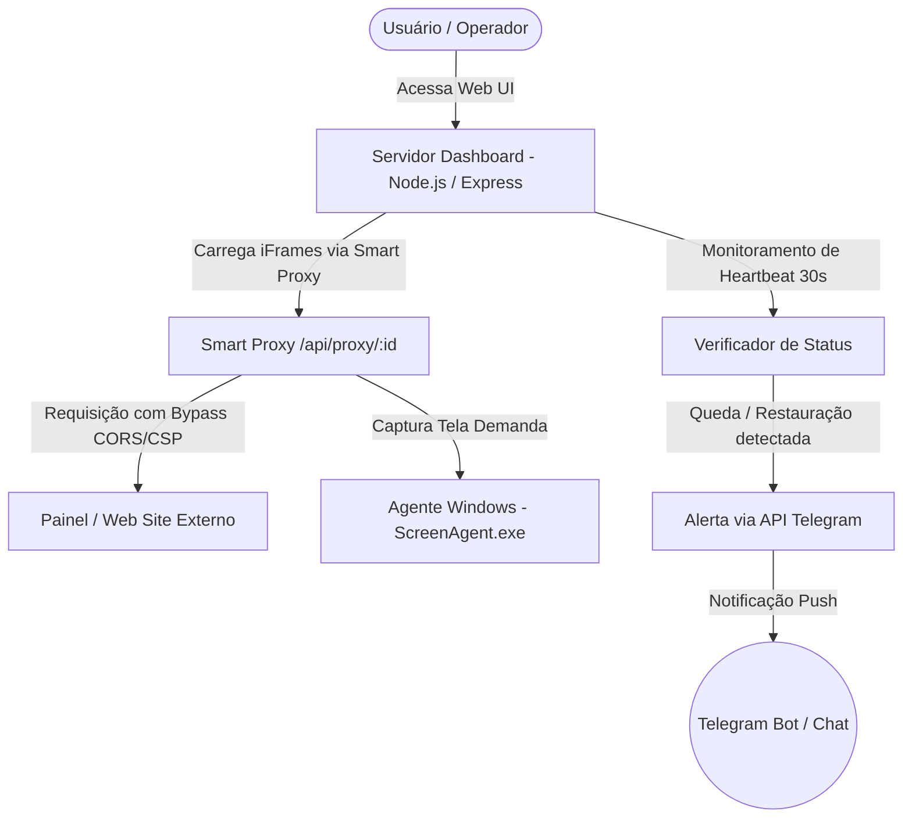

# monitorPaineis — Painel de Monitoramento & Agente de Transmissão

> **Uma solução premium para monitoramento de painéis, dashboards e computadores remotos com bypass de CORS/iFrame inteligente e alertas no Telegram.**

---

## Sobre o Projeto

O **monitorPaineis** é uma plataforma robusta desenvolvida para monitorar e exibir múltiplos painéis de forma centralizada. Ele resolve um dos maiores problemas ao incorporar sites e sistemas em `<iframe>` (bloqueios de **CORS**, **X-Frame-Options** e **CSP**) por meio de um **Smart Proxy** integrado no servidor Node.js. 

Além disso, o projeto inclui um **Agente de Transmissão de Tela em C#** para Windows que captura a área de trabalho de computadores e a transmite em tempo real sob demanda, e um sistema de **Alertas no Telegram** que notifica quedas e restaurações de conexão de qualquer painel cadastrado.

---

## Principais Recursos

*    **Multi-painéis Premium**: Visualização lado a lado de múltiplos painéis em grade responsiva, com suporte a modo tela cheia individual.
*    **Smart Proxy (Bypass de iFrame/CORS)**: Encaminha requisições dinamicamente através do backend, removendo cabeçalhos restritivos (`x-frame-options`, `content-security-policy`) e injetando a tag `<base>` para garantir que recursos relativos (imagens, scripts, CSS) carreguem corretamente.
*    **Integração com Telegram**:
    *   Alertas automáticos de **CONEXÃO PERDIDA** (Offline) e **CONEXÃO RESTABELECIDA** (Online).
    *   Configuração e teste de conexão diretamente pela interface do painel.
    *   Recurso de busca automática de **Chat ID** ("Obter ID") buscando mensagens recentes enviadas ao seu bot.
*    **Agente C# de Transmissão**: Agente Windows leve em C# (sem necessidade de privilégios de administrador) para capturar e redimensionar dinamicamente telas em formato JPEG eficiente.
*    **Armazenamento Seguro e Local**: Arquivos de dados de painéis e chaves de API salvos localmente e excluídos do rastreamento do Git (`.gitignore`).

---

##  Arquitetura do Sistema



---

## Estrutura do Repositório

```text
├── src/
│   ├── agent/
│   │   └── ScreenAgent.cs        # Código fonte do Agente de Captura de Tela (C#)
│   └── dashboard/
│       ├── data/                 # Armazenamento local (ignorado pelo Git)
│       │   ├── panels.json       # Configuração de painéis cadastrados
│       │   └── telegram.json     # Configuração e token do Telegram
│       ├── public/               # Frontend (HTML, CSS customizado, Javascript vanilla)
│       │   ├── index.html
│       │   ├── style.css
│       │   └── app.js
│       └── server.js             # Servidor Backend Express & Smart Proxy
├── install-node.ps1              # Script de apoio para Windows
├── package.json                  # Dependências e scripts do Node.js
└── .gitignore                    # Exclusão de credenciais e dependências
```

---

## Como Rodar o Dashboard (Servidor Node.js)

### Pré-requisitos
*   [Node.js](https://nodejs.org/) instalado.

### Passo a Passo

1.  **Instale as dependências** na raiz do projeto:
    ```bash
    npm install
    ```

2.  **Inicie o servidor de desenvolvimento**:
    ```bash
    npm run dev
    ```
    Ou para produção:
    ```bash
    npm start
    ```

3.  **Acesse no navegador**:
    ```text
    http://localhost:3000
    ```

---

## Como Configurar o Agente de Transmissão de Tela (C#)

O `ScreenAgent.cs` monitora a tela principal do Windows e a envia como JPEG de forma extremamente leve sob demanda.

### Como Compilar

Você pode compilar o arquivo `.cs` diretamente no prompt de comando do Windows (CMD) usando o compilador C# nativo do Windows:

1. Abra o prompt de comando do Windows.
2. Navegue até a pasta do agente:
   ```cmd
   cd src\agent
   ```
3. Compile executando o comando:
   ```cmd
   C:\Windows\Microsoft.NET\Framework64\v4.0.30319\csc.exe /target:winexe ScreenAgent.cs
   ```
   *Nota: O parâmetro `/target:winexe` faz com que o programa rode em segundo plano sem abrir uma janela preta de console.*

### Como Executar

Dê um duplo clique no executável gerado `ScreenAgent.exe` ou inicie via terminal especificando uma porta personalizada (porta padrão é `5000`):
```bash
ScreenAgent.exe 5000
```

### Como Adicionar ao Dashboard
1. Clique em **Adicionar Painel** no dashboard.
2. Preencha com o IP do computador onde o agente está rodando.
3. Defina a porta como `5000` (ou a selecionada).
4. No campo **Tipo**, selecione **Transmissão de Tela (Agent)**.
5. Habilite a opção **Usar Proxy Inteligente (Bypass CORS/iFrame)**.

---

## Configuração do Telegram

Para ativar as notificações automatizadas em caso de queda de conexões de painéis:

1. No canto superior direito do dashboard, clique no ícone ** Telegram**.
2. Preencha o **Token do Bot** (Gerado pelo [@BotFather](https://t.me/BotFather) no Telegram).
3. Se você não sabe o ID do seu chat/grupo:
   - Adicione seu Bot ao grupo ou inicie uma conversa com ele.
   - Envie qualquer mensagem no chat (ex: "olá").
   - Clique em **Obter ID** na interface do dashboard. O sistema listará os IDs dos chats recentes!
4. Marque a opção **Ativar Notificações do Telegram**.
5. Clique em **Testar Conexão** para validar.
6. Salve a configuração.

